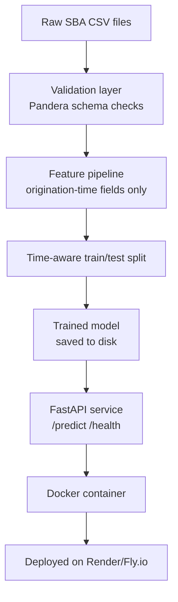

# SBA Loan Default Risk Predictor

## Problem
Evaluating SBA loan application at origination, to decide how to price and structure a loan with limited quantified sense of default risk beyond underwriter judgment. 

**Objective:** Using only information known at origination (loan amount, term, industry(NAICS code), business type, SBA guaranteed percentage, jobs supported, state, franchise status), to estimate the probability the loan eventually charges off rather than gets paid in full.

**Machine Learning Task:** Binary Classification

**Success Metric:** Recall/Precision/F1 + Calibration

**Business Metrics:** Of the loans the model flags as high-risk, what fraction actually charged off, vs the baseline default rate across the whole portfolio?

## Architecture:

### Leakage Rule
Only information known at the moment a loan is originated is allowed as a feature — loan amount, term, industry (NAICS code), business type, SBA guaranteed percentage, and similar origination-time fields. Anything only known or recorded after the loan starts performing — a charge-off date, for instance — is excluded, because the model would effectively be reading the answer before making its prediction. The tell if this rule ever gets broken by accident: suspiciously high accuracy on a problem that's genuinely hard to predict well. 

### Seasoning Cutoff
Filtering to resolved loans (paid-in-full or charged-off) isn't enough on its own. This file starts at FY2020, and charge-offs take time to happen — a loan approved last year hasn't had time to default yet, so it sits in an unresolved status, not charged-off. Training only on resolved loans without accounting for this means the training population skews toward older, already-seasoned loans, while the model will actually be scored on brand-new, unseasoned ones — offline performance would look better than real performance.

**The fix**: derive a seasoning window from the data itself; the time it actually took charged-off loans to charge off (e.g. the 90th percentile of that distribution) — and only include loans old enough, as of the snapshot date, to have had a fair chance to show that outcome. Not an arbitrary "just use FY2020-2022" cutoff; a cutoff computed from observed time-to-default.

### Time-Aware Train/Test Split
The split is chronological, not a random shuffle, for the same underlying reason as the seasoning cutoff: the model will only ever have past loans to learn from and future loans to score, so evaluation should mimic that, not mix time periods together. A natural first idea was splitting by fiscal year, but that doesn't work well here — ApprovalFY only has two values in the modeling population (2020 and 2021), a direct consequence of the seasoning cutoff, and an FY-based split would be a lopsided ~58/42 divide using a 2021 "year" that was already truncated by that same cutoff, not a real full year. Instead, the split is made directly on ApprovalDate at the 80th percentile, which lands at 2021-03-29: 31,433 loans train (6.16% charge-off rate), 7,846 loans test (6.12% charge-off rate). Worth naming explicitly that those two rates are nearly identical — that's the evidence there's no hidden population shift sitting right at the split boundary, which is exactly the kind of thing that quietly breaks an evaluation if nobody checks for it.

### Why default prediction, not approval prediction
Originally, this project set out to predict whether a development application would be approved before being passed by council planning authorities in NSW or the ACT. That data proved inaccessible since NSW's planning API requires a manually issued key, and neither the ACT nor city open-data portals publish individual application records — so the project pivoted to SBA loan data instead, a structurally similar problem that was genuinely open. Looking closer, every loan in that dataset had already been approved and disbursed; lenders don't publish records of applications they rejected, largely for privacy and fair-lending reasons, so there was no rejected-application group left to compare against. That made approval prediction impossible with this data, so the objective became predicting which of those already-approved loans would eventually charge off instead of being paid in full — which, rather than a downgrade, is actually the more standard version of this problem: every lender already knows who they approved and needs to know which of those approvals carry real default risk. 

### Feature Engineering Decisions
The NAICS codes in the dataset consisted of full 6-digit codes, out of which 877 distinct codes in the modeling population, a median of only 10 loans per code. In such cases it is too sparse for a model to learn anything from most individual codes. 

The fix to this was collapsing the NAICS code to its first two digits, i.e, if a code that says 722513 (Limited-Service Restaurants) is shortened to 72 (Accomodation and Food Services). Its just like picking the set rather than the subset so that we have more loan data in a section from which the model can learn from. At this level there are 24 categories with a median of 1054 loans each, so the collapse doesn't destroy the signal. 

The function collapsing the NAICS code is casted with the zero-padding so that in case that any codes are of 6 digits, they are added with some extra 0's to make the numbers 6 digits across the feature/column, so that during the slicing of the string the first two digits are picked out correctly. 

**Note**: The same logic applies to the zip code and congressional district fixes. 

