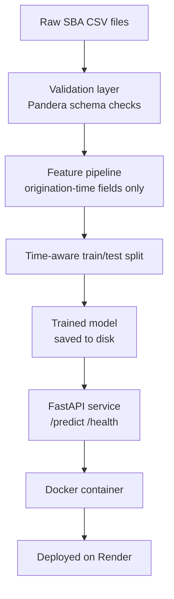

# SBA Loan Default Risk Predictor

## Problem
Evaluating SBA loan application at origination, to decide how to price and structure a loan with limited quantified sense of default risk beyond underwriter judgment. 

**Objective:** Using only information known at origination (loan amount, term, industry(NAICS code), business type, SBA guaranteed percentage, jobs supported, state, franchise status), to estimate the probability the loan eventually charges off rather than gets paid in full.

**Machine Learning Task:** Binary Classification

**Success Metric:** Recall/Precision/F1 + Calibration

**Business Metrics:** Of the loans the model flags as high-risk, what fraction actually charged off, vs the baseline default rate across the whole portfolio?

## Architecture:

```mermaid
flowchart TD
    A[Raw SBA CSV files] --> B[Validation layer<br/>Pandera schema checks]
    B --> C[Feature pipeline<br/>origination-time fields only]
    C --> D[Time-aware train/test split]
    D --> E[Trained model<br/>saved to disk]
    E --> F[FastAPI service<br/>/predict /health]
    F --> G[Docker container]
    G --> H[Deployed on Render]
```

### Leakage Rule
Only information known at the moment a loan is originated is allowed as a feature — loan amount, term, industry (NAICS code), business type, SBA guaranteed percentage, and similar origination-time fields. Anything only known or recorded after the loan starts performing — a charge-off date, for instance — is excluded, because the model would effectively be reading the answer before making its prediction. The tell if this rule ever gets broken by accident: suspiciously high accuracy on a problem that's genuinely hard to predict well. 

### Seasoning Cutoff
Filtering to resolved loans (paid-in-full or charged-off) isn't enough on its own. This file starts at FY2020, and charge-offs take time to happen — a loan approved last year hasn't had time to default yet, so it sits in an unresolved status, not charged-off. Training only on resolved loans without accounting for this means the training population skews toward older, already-seasoned loans, while the model will actually be scored on brand-new, unseasoned ones — offline performance would look better than real performance.

**The fix**: derive a seasoning window from the data itself; the time it actually took charged-off loans to charge off (e.g. the 90th percentile of that distribution) — and only include loans old enough, as of the snapshot date, to have had a fair chance to show that outcome. Not an arbitrary "just use FY2020-2022" cutoff; a cutoff computed from observed time-to-default.

### Time-Aware Train/Test Split
The split is chronological, not a random shuffle, for the same underlying reason as the seasoning cutoff: the model will only ever have past loans to learn from and future loans to score, so evaluation should mimic that, not mix time periods together. A natural first idea was splitting by fiscal year, but that doesn't work well here — ApprovalFY only has two values in the modeling population (2020 and 2021), a direct consequence of the seasoning cutoff, and an FY-based split would be a lopsided ~58/42 divide using a 2021 "year" that was already truncated by that same cutoff, not a real full year. Instead, the split is made directly on ApprovalDate at the 80th percentile, which lands at 2021-03-29: 31,433 loans train (6.16% charge-off rate), 7,846 loans test (6.12% charge-off rate). Worth naming explicitly that those two rates are nearly identical — that's the evidence there's no hidden population shift sitting right at the split boundary, which is exactly the kind of thing that quietly breaks an evaluation if nobody checks for it.

### Why default prediction, not approval prediction
Originally, this project set out to predict whether a development application would be approved before being passed by council planning authorities in NSW or the ACT. That data proved inaccessible since NSW's planning API requires a manually issued key, and neither the ACT nor city open-data portals publish individual application records — so the project pivoted to SBA loan data instead, a structurally similar problem that was genuinely open. Looking closer, every loan in that dataset had already been approved and disbursed; lenders don't publish records of applications they rejected, largely for privacy and fair-lending reasons, so there was no rejected-application group left to compare against. That made approval prediction impossible with this data, so the objective became predicting which of those already-approved loans would eventually charge off instead of being paid in full — which, rather than a downgrade, is actually the more standard version of this problem: every lender already knows who they approved and needs to know which of those approvals carry real default risk. 

### Feature Engineering Decisions
**1. The NAICS codes** The dataset consisted of full 6-digit codes, out of which 877 distinct codes in the modeling population, a median of only 10 loans per code. In such cases it is too sparse for a model to learn anything from most individual codes. 

The fix to this was collapsing the NAICS code to its first two digits, i.e, if a code that says 722513 (Limited-Service Restaurants) is shortened to 72 (Accomodation and Food Services). Its just like picking the set rather than the subset so that we have more loan data in a section from which the model can learn from. At this level there are 24 categories with a median of 1054 loans each, so the collapse doesn't destroy the signal. 

The function casts the code to a zero-padded 6-digit string before slicing it. This matters because the code is read from the CSV as a number, which silently drops any leading zero — a code like 081234 becomes 81234, which looks like it only has 5 digits. Padding back to 6 digits first guarantees the correct first two digits get picked out, regardless of whether the original code lost a leading zero.

**Note**: The same logic applies to the zip code and congressional district fixes. 

**2. LenderType** The dataset separately records an FDIC number and an NCUA number for each lender, and both are blank for a meaningful share of loans. That looks like missing data at first glance, but it isn't — it's blank because of which kind of lender made the loan, not because the value is unknown. Banks report an FDIC number; credit unions report an NCUA number; non-depository SBA lenders (companies like Newtek or ReadyCap that aren't banks or credit unions at all) legitimately have neither, because neither field applies to them. In the modeling population: 36,084 loans have only an FDIC number (banks), 1,263 have only an NCUA number (credit unions), and 1,891 have neither (non-depository lenders) — real, distinct categories, not broken rows. A small number (41) have both, which gets folded into "Bank" since FDIC coverage is the dominant signal there. Rather than leaving two mostly-blank columns for a model to make nothing of, this gets collapsed into a single LenderType category (Bank / CreditUnion / NonDepository) that actually encodes what was happening in the blanks.

**3. BusinessAge** The raw data already includes an explicit "Unanswered" category for this field — the SBA itself treats "the applicant didn't answer" as a legitimate answer, not a data quality failure. A small share of rows (0.29%) show up as a true null instead of that string, which is inconsistent: it leaves two different-looking representations of the same "unknown" state in the same column. Those nulls get folded into the existing "Unanswered" category so there's one canonical value for "this wasn't reported," not two.

**4. Columns dropped before modeling** BorrZip, BankZip, BankName, BankCity, and ProjectCounty are too fragmented to learn from — the median category has only 2-6 loans in it, and 80-99.9% of categories have fewer than 30 loans total, the same sparsity problem that ruled out the full 6-digit NAICS code in the first place. CongressionalDistrict gets dropped for a different reason: the same district number means different things in different states (district 5 in Illinois has an 8.3% charge-off rate versus 2.3% in Minnesota), so treating it as one category without pairing it to state would actively mislead a model rather than just add noise. ApprovalDate is dropped too — it's a legitimate origination-time feature under the leakage rule, but feeding a raw date to the model would let it distinguish training-period loans from test-period loans without learning anything that generalizes to a loan approved next year.

### Baseline Model
The baseline is logistic regression, chosen deliberately over a more complex model for a first pass — credit risk models need to be explainable to underwriters, not just accurate, and logistic regression's coefficients are directly interpretable.

One design decision worth documenting: an earlier version used class_weight="balanced" to compensate for charge-offs being a small share of loans (~6%). That improved recall, but broke calibration — verified on the held-out test set, it inflated every predicted probability (a loan the model rated 81% risk actually defaulted 30% of the time), and its Brier score (0.130, lower is better) was worse than a trivial model that just guesses the overall default rate for everyone (0.057). Removing class_weight fixed it: Brier score dropped to 0.048, beating that trivial baseline, while the model's ability to rank risky loans ahead of safe ones barely changed (ROC-AUC 0.834 vs 0.838). That confirmed class weighting and calibration are separate concerns — the recall/precision tradeoff is now a deliberate choice of decision threshold on honest probabilities, not a side effect of how the loss function happened to be weighted during training.

On the held-out test set (7,846 loans approved after March 2021): ROC-AUC 0.834, PR-AUC 0.34, Brier score 0.048.

### Model Comparison
XGBoost was compared against the logistic regression baseline on the same held-out test set, using the same preprocessing pipeline (same features, same encoding) so the model was the only thing that changed. The result wasn't close: ROC-AUC 0.926 versus 0.834, PR-AUC 0.687 versus 0.34, Brier score 0.030 versus 0.048 — XGBoost won decisively on every metric, including calibration.

Before trusting that gap, two checks were run to rule out the obvious ways a result like this can be misleading. First, overfitting: training-set AUC was 0.962 against a test-set AUC of 0.926, a gap of only 0.037 — small enough to indicate the model learned real patterns rather than memorizing the training data. Second, calibration: binning predictions the same way as the baseline check showed predicted and actual charge-off rates tracking closely across every bin, with the model if anything slightly underestimating risk in the highest-risk bin (a conservative, not a dangerous, direction to be wrong in).

This creates a real tension worth stating directly rather than glossing over: logistic regression was chosen as the baseline specifically because credit risk models need to be explainable to underwriters, and this result puts pressure on that reasoning — a gap this large can't be waved away with "we'll keep the simpler model on principle." The resolution: XGBoost is adopted as the model going forward, with feature importance or SHAP values used to recover explainability instead of relying on the model architecture being inherently simple. This mirrors how gradient-boosted models are actually used in production credit risk systems — accuracy and explainability aren't mutually exclusive if you're deliberate about which model does which job.

### Model Interpretability (SHAP)
A credit risk model that can't explain itself isn't usable by an underwriter, so SHAP values are computed against the trained XGBoost pipeline to recover per-loan and global feature attributions. `compute_shap_values` runs `shap.TreeExplainer` on the preprocessed feature matrix, and `global_feature_importance` ranks features by mean absolute SHAP value across the test set.

One real bug surfaced building this: an early version densified the sparse preprocessed matrix (`.toarray()`) before computing SHAP values, which silently produced a completely different, wrong feature ranking — no error thrown, just quietly incorrect output. It was caught using SHAP's additivity property as a correctness check: for every row, the sum of that row's SHAP values plus the explainer's expected value must equal the model's raw margin output. When it didn't, that proved the explanations were wrong before they were ever trusted. The fix was removing `.toarray()` — XGBoost was trained on sparse input, where an absent entry means "missing," not "zero," and densifying broke that distinction. The lesson generalizes: an explainability method is only trustworthy if it's been verified against the actual model it's explaining, not just run and assumed correct.

### Decision Threshold Selection
XGBoost outputs a probability, not a decision — something has to translate "6% probability of charge-off" into "flag this loan or don't." `threshold_sweep` computes precision, recall, F1, and lift at every possible threshold using the test set's precision-recall curve, and `best_f1_threshold` picks the threshold that maximizes F1 as the default operating point.

At the chosen threshold (0.3221): precision 0.771, recall 0.602, F1 0.676, and a lift of 12.6x over the base charge-off rate — meaning a loan flagged by the model is about 12.6 times more likely to actually charge off than a random loan in the portfolio. That lift number is the one that actually matters to the credit/risk persona this project is built for: it's a direct, concrete answer to "if we act on this model's flags, how much better off are we than acting randomly."

### Raw-Data Validation (Pandera)
Government FOIA data has no guaranteed schema contract, so the pipeline validates the raw CSV immediately after `pd.read_csv()`, before any parsing or feature derivation happens. The schema checks column types, value ranges (`GrossApproval > 0`, for instance), and a cross-column invariant that `SBAGuaranteedApproval` can never exceed `GrossApproval`. Validation runs with `lazy=True`, so every violation in a batch is reported at once instead of failing on the first — useful for actually fixing problems rather than discovering them one at a time.

### Model Persistence
`train.py` is the single, reproducible entry point for the full pipeline — load, validate, split, train, save — replacing what used to be ad-hoc interactive commands that were never saved anywhere. It persists two artifacts: `models/xgboost_pipeline.joblib` (the complete sklearn `Pipeline`, preprocessing and model together) and `models/metadata.json` (the chosen decision threshold, its precision/recall/F1/lift, and the train/test split cutoff date). The API loads both at startup rather than hardcoding the threshold as a magic number — if the model gets retrained with a different threshold, everything downstream picks it up automatically.

### Test Suite
29 unit tests (plus 4 more covering the API, 33 total) run against small, hand-built synthetic DataFrames rather than the full 388k-row CSV, so the suite runs in about two seconds and stays fully deterministic. Several tests exist specifically because they codify real bugs this project surfaced during development: NAICS codes silently losing a leading zero when cast from the CSV, FDIC/NCUA-based lender-type misclassification, and the guaranteed-exceeds-gross invariant. A future change that reintroduces any of those bugs fails loudly instead of shipping silently.

### API (FastAPI)
The service exposes `/health` and `/predict`. A `lifespan` context manager loads the model and metadata once at startup rather than on every request. Critically, `/predict` accepts raw loan fields exactly as a lender's own system would have them — a `NaicsCode`, the presence or absence of a `BankFDICNumber`/`BankNCUANumber` — and reuses the exact same derivation functions from the training pipeline (`derive_naics_sector`, `derive_lender_type`, etc.) server-side, rather than duplicating that logic in the API layer where it could silently drift out of sync with how the model was actually trained.

Verified end-to-end against real historical loans: a loan that was actually paid in full scores low risk, matching an independently-computed run through the offline pipeline to floating-point precision; a loan that actually charged off is correctly flagged above threshold; a malformed request (a missing required field) returns a clean 422 instead of crashing.

### Containerization (Docker)
The service runs in a `python:3.11-slim` container as a non-root user, with a `HEALTHCHECK` against `/health` so orchestration tooling can tell whether the container is actually serving traffic. Two real, environment-specific bugs surfaced here that never appeared running the API directly on macOS: xgboost's PyPI package unconditionally requires a ~350MB NVIDIA CUDA library on any Linux platform regardless of whether a GPU exists, worked around by installing xgboost with `--no-deps`; and copying application files into the image before switching to the non-root user left them unreadable by that user, fixed with `COPY --chown`. Verified: the containerized `/predict` endpoint returns byte-identical predictions to every non-containerized run.

### Continuous Integration
`.github/workflows/ci.yml` runs the full test suite on every push and pull request to `main`. One real bug surfaced setting this up: the workflow initially called bare `pytest`, which — unlike `python -m pytest`, used throughout local development — doesn't add the project root to `sys.path` on its own, causing every test file's `from src...` import to fail with `ModuleNotFoundError`. Fixed with a `pytest.ini` declaring `pythonpath = .`, which makes `pytest` resolve the project root the same way regardless of how it's invoked.

### Deployment
The containerized service is deployed on Render's free tier, auto-deploying from GitHub on every push to `main`. Live at the URL below. Verified independently from a third machine entirely separate from both the development machine and Render's own infrastructure: `/health` returns 200, and `/predict` returns the exact same probability as every offline run throughout this project, confirming the deployed service is consistent with the training pipeline down to the floating-point value.

**Live API:** https://sba-loan-risk.onrender.com (see `/docs` for interactive testing — the free tier spins down after inactivity, so the first request after idle time can take up to ~50 seconds to wake back up)

### Known Limitations / Future Work
`scikit-learn` is currently unpinned in `requirements.txt` (`>=1.3`). The committed model was trained against scikit-learn 1.8.0, but a fresh environment today resolves 1.9.1, which produces an `InconsistentVersionWarning` on unpickling — predictions have remained correct so far, but scikit-learn's own documentation warns this can silently break across large enough version gaps. Worth pinning exactly to the trained version as a follow-up.
